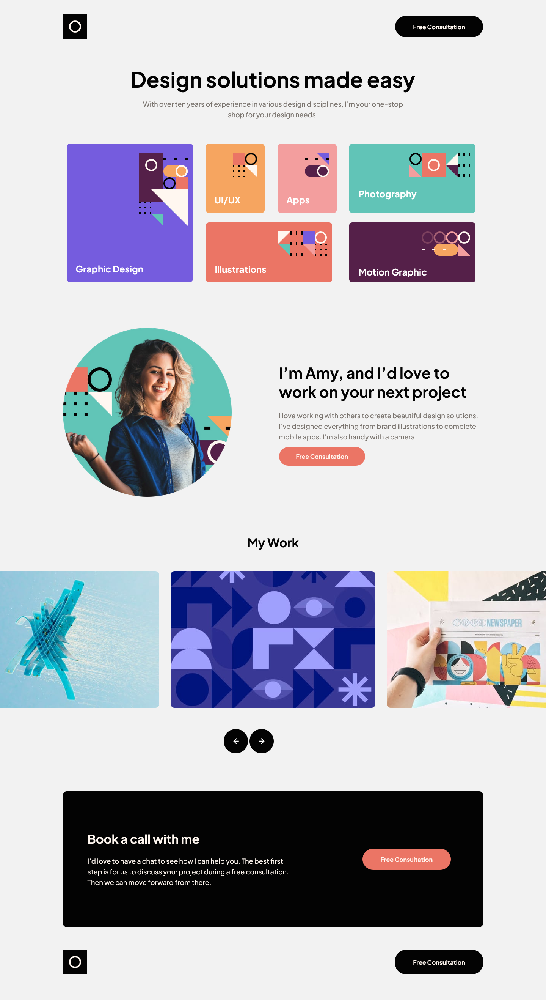
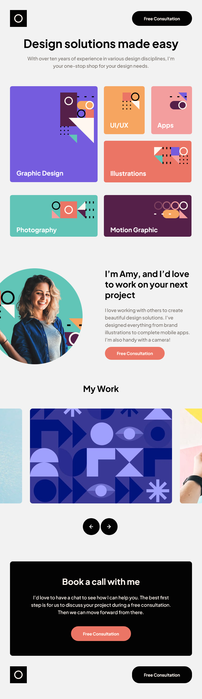
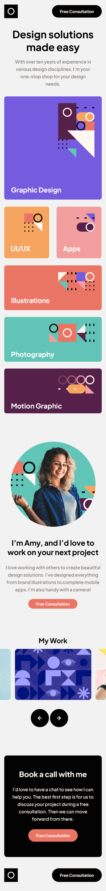

## Table of contents

- [Overview](#overview)
  - [The challenge](#the-challenge)
  - [Screenshot](#screenshot)
  - [Links](#links)
- [My process](#my-process)
  - [Built with](#built-with)
  - [What I learned](#what-i-learned)
  - [Continued development](#continued-development)
  - [Useful resources](#useful-resources)
- [Author](#author)
- [Acknowledgments](#acknowledgments)

## Overview

In this project I mainly needed to focus on page layout,page responsiveness and image slider functionality.

### The challenge

Users should be able to:

- View the optimal layout for each page depending on their device's screen size
- See hover states for all interactive elements throughout the site

### Screenshot

### Links

- Solution URL: [GitHub Code](https://github.com/Tusho7/Single-Page-Design)
- Live Site URL: [GitHub Live](https://tusho7.github.io/Single-Page-Design/)

## My process

Create Header
Add background color
Add logo
Create divs
Add texts
Add images
Add slider
Give styles in CSS
Add hover effects in CSS
Add Javascript code to make slider functional

### Built with

- Semantic HTML5 markup
- CSS custom properties
- Mobile first approach
- Flexbox
- CSS Grid
- Media Queries
- Javascript

### What I learned

While working on this project, I gained more practise of using Media Queries & Javascript,  the main challenge that I overcame was to create Js Functionality for the App.After research and practicing different ways for resolving this step, I wrote the Javascript code which worked eventually and slider become functional for any display size.

### Continued development

I want to create other projects like this to finally master coding and make more dynamic, interactive and functional projects

## Author

- GitHub - [Sandro Tushurashvili](https://github.com/Tusho7)
- LinkedIn - [Sandro Tushurashvili](https://www.linkedin.com/in/sandro-tushurashvili/)